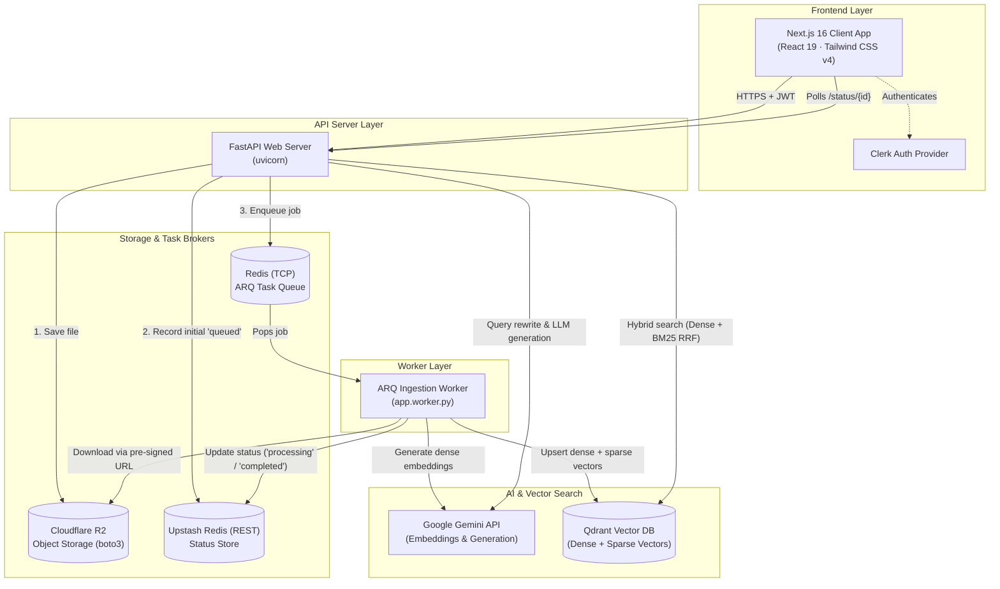
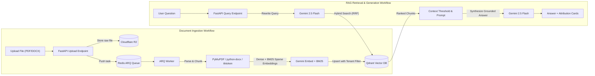
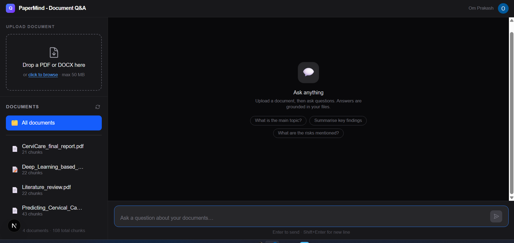
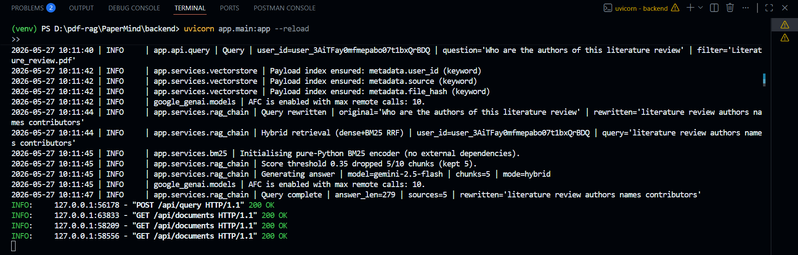

# 📄 PaperMind - RAG Document Q&A

<div align="center">


**A production-grade Retrieval-Augmented Generation (RAG) application for intelligent document Q&A.**  
Upload PDFs and DOCX files, then ask natural-language questions grounded in your content.

</div>

---

## Table of Contents

- [Overview](#overview)
- [Features](#features)
- [Tech Stack](#tech-stack)
- [Architecture](#architecture)
- [Screenshots](#screenshots)
- [Docker Quickstart](#docker-quickstart)
- [Manual Installation](#manual-installation)
  - [Prerequisites](#prerequisites)
  - [1. Redis Setup](#1-redis-setup)
  - [2. Backend Setup](#2-backend-setup)
  - [3. ARQ Worker Setup](#3-arq-worker-setup)
  - [4. Frontend Setup](#4-frontend-setup)
- [Production Deployment](#production-deployment)
- [Environment Variable Reference](#environment-variable-reference)

---

## Overview

PaperMind is a full-stack RAG Document Q&A application that lets you upload documents and ask questions about them in natural language. Answers are grounded exclusively in your uploaded content — eliminating hallucinations from general knowledge.

The system uses **hybrid search** (dense semantic vectors + BM25 keyword retrieval) fused via Reciprocal Rank Fusion (RRF), **Google Gemini** for both embeddings and generation, and **Qdrant** as the vector database. Every component is designed for multi-tenant production use with per-user data isolation enforced at the database level.

### Key Infrastructure Highlights

- **Cloudflare R2 Storage**: S3-compatible cloud object storage with **zero egress fees**, pre-signed time-limited download URLs, and per-user key namespacing (`rag-uploads/{user_id}/{document_id}{.ext}`). Falls back to local disk storage in development.
- **Decoupled Background Ingestion via ARQ**: Long-running ingestion jobs (parsing, chunking, and embedding with rate-limit delays) are offloaded to an asynchronous, distributed worker process powered by **ARQ (Async Redis Queue)**. The FastAPI web server stays fully responsive, jobs survive server restarts, and workers can scale horizontally.
- **Dual Redis Roles**: Uses standard TCP Redis for atomic worker task queuing and scheduling (via ARQ), alongside Upstash Redis (REST) for lightweight, serverless job status polling.
- **Zero-Setup Local Dev**: Local development requires only a Google AI Studio API key and a Clerk instance. Local disk storage and an in-memory status store are used when cloud credentials are omitted.

---

## Features

| Category | Highlights |
|---|---|
| **Ingestion** | PDF & DOCX parsing · boilerplate stripping · tiktoken chunking · SHA-256 deduplication · async HTTP 202 + status polling · ARQ distributed worker queue with automatic retries & exponential backoff |
| **Retrieval** | Hybrid dense + BM25 search via Qdrant RRF · Gemini query rewriting · configurable score threshold · per-document scoping |
| **Generation** | Answers grounded exclusively in uploaded content · source attribution with filename, page, and relevance score |
| **Auth** | Clerk RS256 JWT · JWKS-cached verification · zero identity database overhead |
| **Multi-tenancy** | `user_id` stamped on every vector point · all DB operations filtered at the database level · tenant-isolated storage paths and status API |
| **Infrastructure** | Zero-config local dev · cloud backends (Qdrant Cloud, Upstash Redis, Cloudflare R2, Redis TCP) · isolated ARQ workers · full Docker & Docker Compose setup with horizontal worker scaling · `/health` probe endpoint checking Qdrant & ARQ Redis |
| **Frontend** | Drag-and-drop uploader · GFM Markdown rendering · responsive sidebar · confidence-graded source cards |

---

## Tech Stack

| Component | Backend | Frontend |
|---|---|---|
| **Language** | Python 3.11+ | TypeScript 5 |
| **Framework** | FastAPI (uvicorn) | Next.js 16 (App Router, React 19) |
| **LLM / Embeddings** | Google Gemini 2.5 Flash / gemini-embedding-001 | — |
| **Vector DB** | Qdrant (local disk or Qdrant Cloud) | — |
| **Sparse Retrieval** | Pure-Python BM25 | — |
| **Orchestration** | LangChain | — |
| **Document Parsing** | PyMuPDF · python-docx | — |
| **Task Queue & Workers** | ARQ (Async Redis Queue) + TCP Redis | — |
| **Job Status Store** | Upstash Redis (REST) / in-memory | — |
| **Object Storage** | Cloudflare R2 (S3-compatible via boto3) / local disk | — |
| **Auth** | Clerk (RS256 JWT / JWKS verification) | Clerk (`@clerk/nextjs`) |
| **Styling** | — | Tailwind CSS v4 |
| **Markdown** | — | react-markdown + remark-gfm |
| **File Uploads** | — | react-dropzone |
| **Containerization** | Docker & Docker Compose | Docker (standalone output) |

---

## Architecture



### Workflow Flowchart



The system is composed of four decoupled tiers:

1. **Frontend (Next.js 16)** — Authenticates users with Clerk, renders the drag-and-drop uploader with status polling, manages the document sidebar, and powers the chat interface with Markdown and source attribution cards.
2. **Backend Web Server (FastAPI)** — Exposes REST endpoints for upload, document management, and RAG queries. On upload, it saves the file to Cloudflare R2, records a `queued` state in the status store, enqueues an ingestion job into Redis, and returns HTTP 202 immediately. It never runs CPU/network-heavy ingestion in the web process.
3. **Background Worker (ARQ Worker)** — A dedicated, stateless Python worker (`arq app.worker.WorkerSettings`) that pulls jobs from Redis, generates a pre-signed URL to download from Cloudflare R2, extracts and chunks text, computes Gemini dense and BM25 sparse embeddings, upserts vectors to Qdrant, and reports progress to the status store.
4. **Data & Storage Tier** — 
   - **Cloudflare R2**: Secure, private object store for raw PDF/DOCX files with zero egress fees.
   - **Qdrant**: Vector database storing dense + sparse vectors in a unified collection with `user_id` tenant filtering.
   - **Redis (TCP)**: Reliable broker for the ARQ background task queue.
   - **Upstash Redis (REST)**: Stores polling-accessible ingestion lifecycle states (`queued` → `processing` → `completed` | `failed`).
   - **Google Gemini**: Powers query rewriting, `gemini-embedding-001` embeddings, and grounded answer generation.

For a comprehensive technical breakdown, see [`docs/ARCHITECTURE.MD`](docs/ARCHITECTURE.MD).

---

## Screenshots

### Application Interface


### Background Ingestion & Processing


### End-to-End Demo


---

## Docker Quickstart

The fastest way to spin up the entire PaperMind stack (Redis, FastAPI, ARQ Worker, and Next.js Frontend) is via Docker Compose:

### 1. Configure environment files

```bash
# Clone the repository
git clone https://github.com/your-org/rag-document-qa.git
cd rag-document-qa

# Configure root build args (Clerk credentials)
cp .env.example .env

# Configure backend environment
cp backend/.env.example backend/.env

# Configure frontend environment
cp frontend/.env.example frontend/.env
```

Edit the `.env` files with your **Google Gemini API Key** and **Clerk** credentials.

### 2. Launch the stack

```bash
docker compose up --build
```

The services will become available at:
- **Frontend**: `http://localhost:3000`
- **FastAPI API**: `http://localhost:8000`
- **API Health Check**: `http://localhost:8000/health`
- **Interactive Swagger Docs**: `http://localhost:8000/docs`

### 3. Horizontal Worker Scaling

To process high volumes of document uploads concurrently, scale the ARQ ingestion worker across multiple containers:

```bash
docker compose up --scale arq-worker=3 -d
```

---

## Manual Installation

### Prerequisites

- Python 3.11+
- Node.js 18+
- Docker (for running local Redis)
- A [Google AI Studio](https://aistudio.google.com/) API key
- A [Clerk](https://clerk.com/) account

### 1. Redis Setup

ARQ requires a standard TCP Redis connection:

```bash
docker run -d --name papermind-redis -p 6379:6379 redis:7-alpine
```

### 2. Backend Setup

```bash
cd backend

# Create and activate virtual environment
python -m venv venv
source venv/bin/activate       # Windows: venv\Scripts\activate

# Install dependencies
pip install -r requirements.txt

# Copy environment template
cp .env.example .env
```

Edit `backend/.env` with your credentials:

```env
# Required
GOOGLE_API_KEY=your_google_api_key_here
CLERK_ISSUER=https://<your-clerk-subdomain>.clerk.accounts.dev

# ARQ Redis (TCP)
REDIS_URL=redis://localhost:6379

# Optional Cloud Backends (leave empty for local dev fallbacks)
QDRANT_URL=
QDRANT_API_KEY=
UPSTASH_REDIS_REST_URL=
UPSTASH_REDIS_REST_TOKEN=
R2_ACCOUNT_ID=
R2_ACCESS_KEY_ID=
R2_SECRET_ACCESS_KEY=
R2_BUCKET_NAME=papermind-uploads
R2_ENDPOINT_URL=
CORS_ORIGINS=http://localhost:3000
```

Start the FastAPI server:

```bash
uvicorn app.main:app --reload --port 8000
```

### 3. ARQ Worker Setup

In a separate terminal (with the virtual environment activated and `backend/` as the working directory):

```bash
cd backend
source venv/bin/activate       # Windows: venv\Scripts\activate
arq app.worker.WorkerSettings
```

You should see:
```text
Starting worker for 1 functions: run_ingestion
redis_version=... mem_usage=...
```

### 4. Frontend Setup

In a third terminal:

```bash
cd frontend

# Install dependencies
npm install

# Copy environment template
cp .env.example .env.local
```

Edit `frontend/.env.local`:

```env
NEXT_PUBLIC_CLERK_PUBLISHABLE_KEY=pk_test_...
CLERK_SECRET_KEY=sk_test_...
NEXT_PUBLIC_API_URL=http://localhost:8000
```

Start the Next.js development server:

```bash
npm run dev
```

Open `http://localhost:3000` in your browser.

---

## Production Deployment

For production deployments, enable managed cloud backends via environment variables:

| Service | Environment Variables | Benefits |
|---|---|---|
| **Cloudflare R2** | `R2_ACCOUNT_ID`, `R2_ACCESS_KEY_ID`, `R2_SECRET_ACCESS_KEY`, `R2_BUCKET_NAME`, `R2_ENDPOINT_URL` | Scalable object store, **zero egress fees**, pre-signed time-limited download links, stateless containers |
| **Redis TCP (ARQ)** | `REDIS_URL` (e.g. `rediss://...`) | Persistent, distributed job queue shared across multiple backend and worker replicas |
| **Upstash Redis (REST)** | `UPSTASH_REDIS_REST_URL`, `UPSTASH_REDIS_REST_TOKEN` | Serverless status store accessible over HTTP, survives server restarts |
| **Qdrant Cloud** | `QDRANT_URL`, `QDRANT_API_KEY` | Fully managed, persistent vector storage with high availability |

---

## Environment Variable Reference

### Backend (`backend/.env`)

| Variable | Required | Default | Description |
|---|---|---|---|
| `GOOGLE_API_KEY` | ✅ | — | Google Gemini API key for embeddings and generation |
| `CLERK_ISSUER` | ✅ | — | Clerk Frontend API URL for JWKS RS256 token verification |
| `REDIS_URL` | — | `redis://localhost:6379` | Standard TCP Redis connection string for the ARQ queue |
| `ARQ_MAX_JOBS` | — | `2` | Maximum concurrent ingestion jobs per ARQ worker |
| `ARQ_JOB_TIMEOUT` | — | `600` | Maximum job duration in seconds before timing out |
| `ARQ_MAX_TRIES` | — | `5` | Maximum retry attempts on unexpected job failure |
| `R2_ACCOUNT_ID` | — | — | Cloudflare Account ID |
| `R2_ACCESS_KEY_ID` | — | — | Cloudflare R2 API token Access Key ID |
| `R2_SECRET_ACCESS_KEY` | — | — | Cloudflare R2 API token Secret Access Key |
| `R2_BUCKET_NAME` | — | `papermind-uploads` | Cloudflare R2 bucket name |
| `R2_ENDPOINT_URL` | — | — | Cloudflare R2 endpoint (`https://<account_id>.r2.cloudflarestorage.com`) |
| `UPSTASH_REDIS_REST_URL` | — | — | Upstash Redis REST URL for status store (falls back to in-memory) |
| `UPSTASH_REDIS_REST_TOKEN` | — | — | Upstash Redis REST token |
| `QDRANT_URL` | — | — | Qdrant Cloud URL (falls back to local `./qdrant_data/`) |
| `QDRANT_API_KEY` | — | — | Qdrant Cloud API key |
| `CORS_ORIGINS` | — | `http://localhost:3000` | Comma-separated list of allowed CORS origins |
| `ENABLE_HYBRID_SEARCH` | — | `true` | Enables hybrid dense + BM25 search via Reciprocal Rank Fusion |
| `MIN_SCORE_THRESHOLD` | — | `0.35` | Minimum relevance score to include a retrieved chunk |
| `RETRIEVAL_TOP_K` | — | `10` | Number of candidate chunks retrieved before threshold filtering |
| `MAX_CONTEXT_CHUNKS` | — | `5` | Maximum context chunks passed to Gemini LLM |
| `CHUNK_SIZE` | — | `500` | Tokens per chunk (tiktoken cl100k_base) |
| `CHUNK_OVERLAP` | — | `50` | Token overlap between consecutive chunks |

### Frontend (`frontend/.env.local`)

| Variable | Required | Default | Description |
|---|---|---|---|
| `NEXT_PUBLIC_CLERK_PUBLISHABLE_KEY` | ✅ | — | Clerk Publishable Key for client-side authentication |
| `CLERK_SECRET_KEY` | ✅ | — | Clerk Secret Key for server-side verification |
| `NEXT_PUBLIC_API_URL` | — | `http://localhost:8000` | Backend API base URL |
