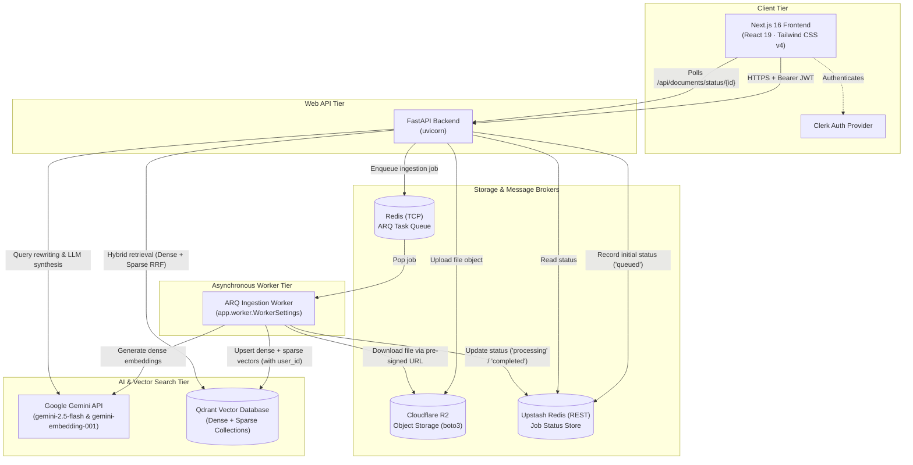
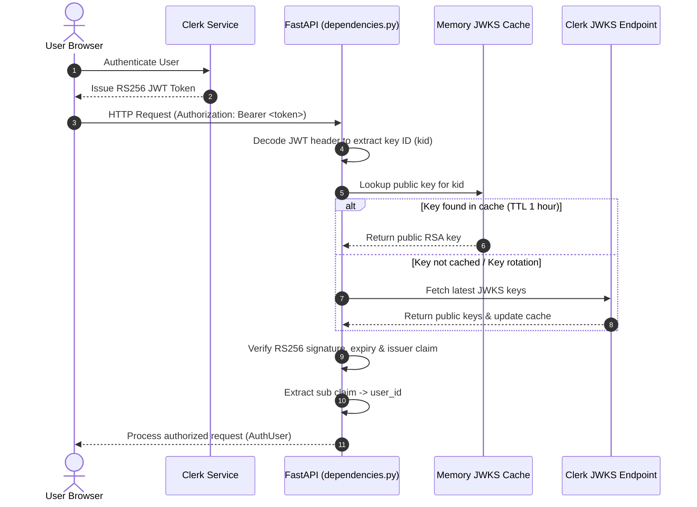
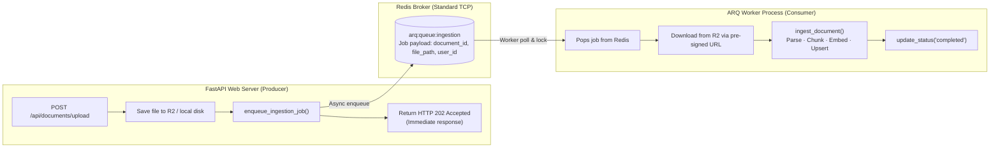
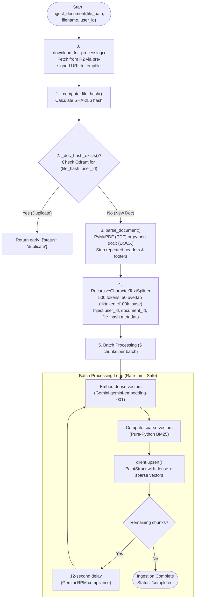
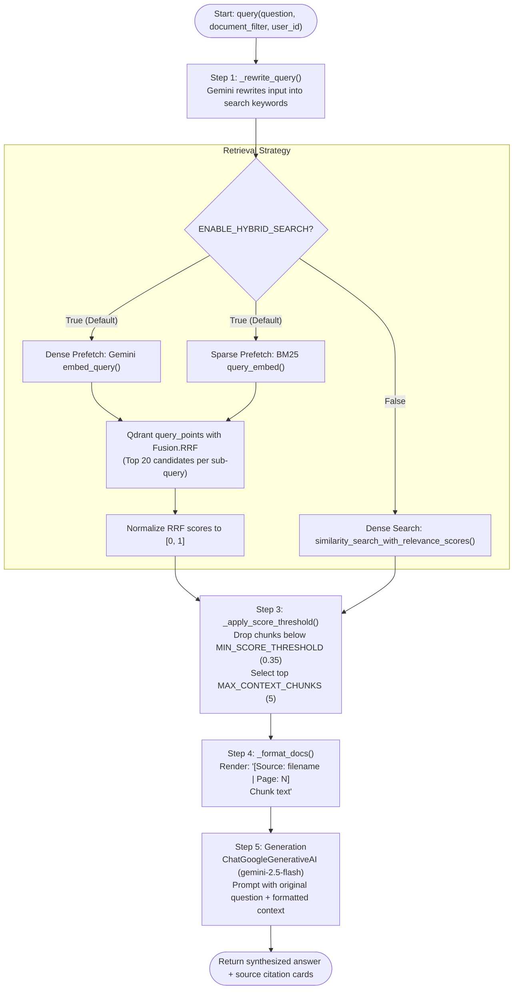
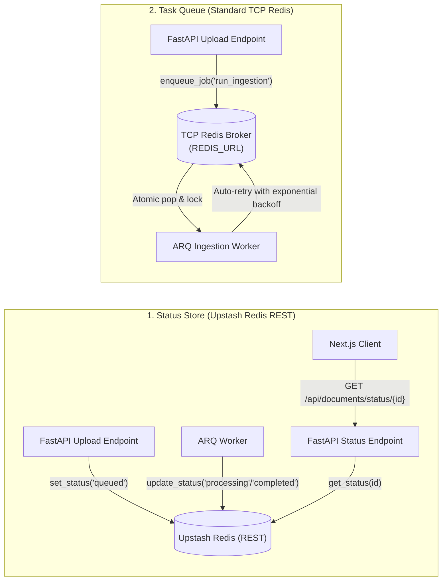
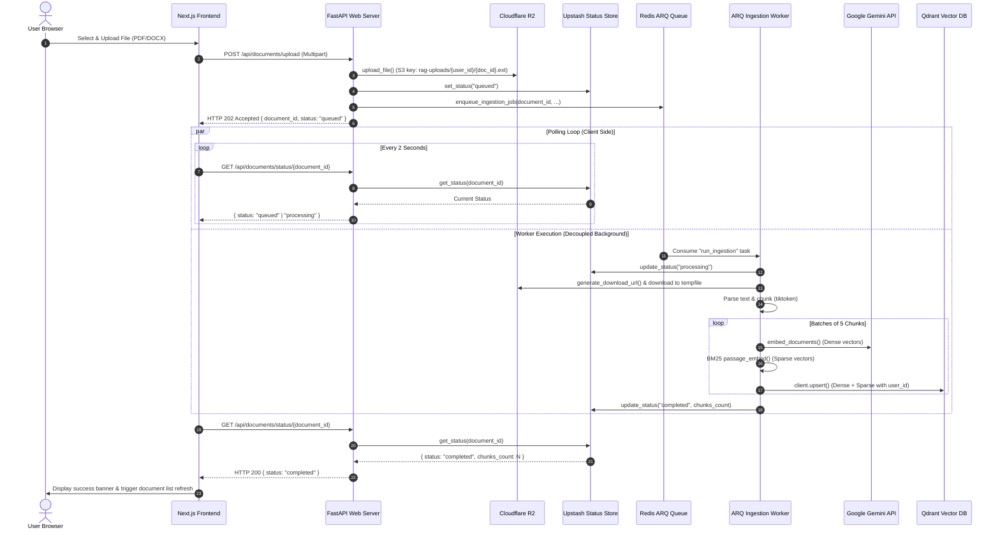
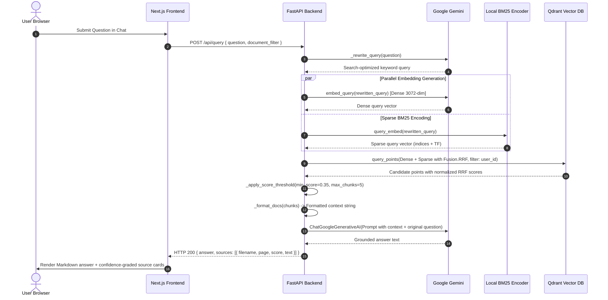
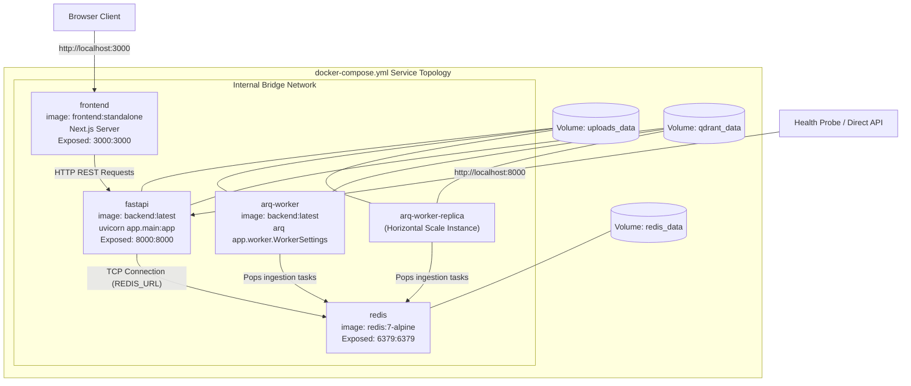

# Architecture — RAG Document Q&A

## Table of Contents

1. [System Overview](#system-overview)
2. [Repository Structure](#repository-structure)
3. [Backend](#backend)
   - [Entry Point & Startup](#entry-point--startup)
   - [Authentication](#authentication)
   - [API Layer](#api-layer)
   - [Asynchronous Task Queue & Workers (ARQ)](#asynchronous-task-queue--workers-arq)
   - [Ingestion Pipeline](#ingestion-pipeline)
   - [RAG Query Pipeline](#rag-query-pipeline)
   - [Vector Store](#vector-store)
   - [BM25 Sparse Encoder](#bm25-sparse-encoder)
   - [Storage Abstraction (Cloudflare R2)](#storage-abstraction-cloudflare-r2)
   - [Dual Redis Roles: Status Store vs Task Queue](#dual-redis-roles-status-store-vs-task-queue)
   - [Document Parsers](#document-parsers)
   - [Configuration](#configuration)
4. [Frontend](#frontend)
   - [Auth & Middleware](#auth--middleware)
   - [Page Layout](#page-layout)
   - [Components](#components)
   - [API Client](#api-client)
5. [Data Flow](#data-flow)
   - [Upload & Ingestion Flow](#upload--ingestion-flow)
   - [Query Flow](#query-flow)
6. [Tenant Isolation](#tenant-isolation)
7. [Containerization & Deployment](#containerization--deployment)
8. [Dev vs Production Backends](#dev-vs-production-backends)
9. [Environment Variables](#environment-variables)

---

## System Overview



The system is organized into four distinct tiers:

1. **Client Tier (Next.js 16)** — Interactive single-page application utilizing React 19, Tailwind CSS v4, Clerk authentication, drag-and-drop file ingestion with status polling, and a conversational chat UI with Markdown and source citation cards.
2. **Web API Tier (FastAPI)** — Lightweight, stateless REST API. Validates requests, verifies Clerk JWT tokens, receives file uploads, stores raw files in Cloudflare R2 (or local disk in dev), registers initial job records in the status store, enqueues ingestion jobs into Redis, and answers RAG queries. Long-running document ingestion is strictly decoupled from the web server.
3. **Worker Tier (ARQ Ingestion Worker)** — Dedicated, stateless Python worker (`app.worker.WorkerSettings`) communicating via standard TCP Redis. Pops ingestion jobs, generates time-limited pre-signed URLs to download source files from Cloudflare R2, parses and chunks documents, generates Gemini dense and BM25 sparse embeddings, upserts vectors to Qdrant, and updates the status store.
4. **Data & Storage Tier**:
   - **Cloudflare R2**: S3-compatible, private cloud object storage for raw PDFs/DOCXs with zero egress fees.
   - **Qdrant**: Vector database housing unified dense + sparse collections with server-side Reciprocal Rank Fusion (RRF) and mandatory tenant filtering.
   - **Redis (TCP)**: Reliable broker and state store for the ARQ asynchronous job queue.
   - **Upstash Redis (REST)**: Serverless, HTTP-accessible key-value store for polling ingestion statuses across distributed instances.
   - **Google Gemini**: Dual-purpose LLM provider used for both dense embeddings (`gemini-embedding-001`) and conversational generation (`gemini-2.5-flash`).

---

## Repository Structure

```
.
├── backend/
│   ├── app/
│   │   ├── api/
│   │   │   ├── query.py          # POST /api/query (RAG Q&A)
│   │   │   └── upload.py         # /api/documents/* (upload, status, list, delete)
│   │   ├── models/
│   │   │   └── schemas.py        # Pydantic request and response schemas
│   │   ├── services/
│   │   │   ├── bm25.py           # Pure-Python BM25 sparse vector encoder
│   │   │   ├── ingestion.py      # Document ingestion, deduplication & embedding
│   │   │   ├── queue.py          # ARQ Redis connection pool & job enqueueing
│   │   │   ├── rag_chain.py      # RAG query pipeline (rewriter, RRF search, LLM)
│   │   │   ├── status_store.py   # Ingestion status tracking (Upstash Redis / in-memory)
│   │   │   ├── storage.py        # Cloudflare R2 / local file storage abstraction
│   │   │   └── vectorstore.py    # Qdrant client, collection setup & tenant filters
│   │   ├── utils/
│   │   │   └── parsers.py        # PDF (PyMuPDF) and DOCX parsers with boilerplate stripping
│   │   ├── config.py             # Pydantic settings with cached loader
│   │   ├── dependencies.py       # Clerk JWT verification dependency (JWKS cached)
│   │   ├── main.py               # FastAPI application, lifespan manager, CORS, /health
│   │   └── worker.py             # ARQ worker definition, job functions & lifecycle hooks
│   ├── .dockerignore
│   ├── .env.example
│   ├── Dockerfile                # Multi-stage container for both FastAPI and ARQ worker
│   └── requirements.txt
│
├── frontend/
│   ├── app/
│   │   ├── globals.css           # Tailwind CSS v4 styling
│   │   ├── layout.tsx            # ClerkProvider root layout
│   │   └── page.tsx              # Main dashboard and chat interface
│   ├── components/
│   │   ├── ChatWindow.tsx        # Message history & input prompt
│   │   ├── DocumentList.tsx      # Sidebar listing user's documents & delete flow
│   │   ├── FileUpload.tsx        # Drag-and-drop dropzone with status polling
│   │   ├── MessageBubble.tsx     # Markdown renderer for assistant responses
│   │   └── SourceCard.tsx        # Relevance-graded source attribution cards
│   ├── lib/
│   │   └── api.ts                # Authenticated fetch client & polling utilities
│   ├── middleware.ts             # Clerk Edge route protection middleware
│   ├── .dockerignore
│   ├── .env.example
│   ├── Dockerfile                # 3-stage standalone Next.js container
│   ├── next.config.ts            # Next.js configuration (output: "standalone")
│   └── package.json
│
├── docs/
│   └── ARCHITECTURE.MD           # This architectural specification
├── extras/
│   └── MIGRATION.md              # Historical migration guide (R2 & ARQ)
├── .env.example                  # Root environment variables for Docker Compose
└── docker-compose.yml            # Complete stack orchestration (redis, fastapi, worker, frontend)
```

---

## Backend

### Entry Point & Startup

**`app/main.py`**

The FastAPI application initializes through an asynchronous `lifespan` context manager:

1. **Directories**: Ensures local fallback upload directories (`./uploads/`) and local Qdrant data directories (`./qdrant_data/`) exist.
2. **Clerk JWKS**: Pre-fetches Clerk's JSON Web Key Set so initial incoming requests do not incur an outbound HTTP latency penalty.
3. **Qdrant Collection**: Invokes `ensure_collection()` to verify or construct the multi-vector schema (dense + sparse) and logs the active vector count.
4. **ARQ Redis Pool**: Initializes the global `ArqRedis` connection pool via `get_arq_pool()` so job enqueueing is immediate and non-blocking on incoming uploads.
5. **Shutdown Hook**: Gracefully closes the ARQ Redis connection pool on application termination.

#### `/health` Endpoint

Exposes an asynchronous health probe:
- **`services.qdrant`**: Validates connection and reports total indexed chunks.
- **`services.arq_redis`**: Sends a `PING` over the ARQ Redis connection to verify task broker availability.
- Marks status as `degraded` if any dependency fails.

---

### Authentication

**`app/dependencies.py`**

Authentication is completely stateless, relying on Clerk's RS256 JWTs verified against Clerk's public JWKS endpoint. No user database is maintained in PaperMind.

#### JWT Verification Flow



The `AuthUser` dependency (`Annotated[CurrentUser, Depends(get_current_user)]`) injects the authenticated `CurrentUser(user_id, email, username)` into API endpoints. The `user_id` acts as the tenant isolation key across vector records, object storage, and status keys.

---

### API Layer

#### `POST /api/documents/upload`

- Validates file extensions (`.pdf`, `.docx`) and enforces the 50 MB size limit.
- Streams the upload to disk under a UUID-prefixed safe filename.
- Uploads the file to **Cloudflare R2** under `rag-uploads/{user_id}/{document_id}{.ext}` when configured (or retains the local path in dev).
- Records an initial `queued` entry in the status store.
- Calls `await enqueue_ingestion_job(...)` to push the job to the Redis ARQ queue.
- Immediately returns HTTP **202 Accepted** with `{ "document_id": "...", "filename": "...", "status": "queued" }`.
- **Note**: The web server never performs document parsing or embeddings inline; the request returns in under 50ms.

#### `GET /api/documents/status/{document_id}`

- Reads the current ingestion state from the status store (`status_store.py`).
- Returns HTTP 404 if the record does not exist or if `record["user_id"] != current_user.user_id` to prevent cross-tenant enumeration.
- Status values: `queued` → `processing` → `completed` | `duplicate` | `failed`.

#### `GET /api/documents`

- Retrieves all distinct ingested documents for the authenticated user by scrolling Qdrant points filtered by `metadata.user_id`.
- Qdrant is the authoritative source of truth for ingested documents.

#### `DELETE /api/documents/{filename}`

- Deletes all points in Qdrant matching `metadata.user_id == current_user.user_id` and `metadata.source == filename`.
- Calls `delete_file()` in `storage.py` to remove the corresponding asset from Cloudflare R2.
- Deletes the local file from `./uploads/` if present.
- Returns HTTP 404 if no matching documents were found.

#### `POST /api/query`

- Receives a user question and an optional `document_id` / `filename` filter.
- Executes the RAG query pipeline and returns the synthesized answer along with confidence-scored source citations.

---

### Asynchronous Task Queue & Workers (ARQ)

**`app/services/queue.py` & `app/worker.py`**

In earlier iterations, background processing used FastAPI's in-process `BackgroundTasks`. Under production workloads, free-tier Gemini rate limits require 12-second batch sleeps during embeddings. Under `BackgroundTasks`, this starved the FastAPI event loop, blocked concurrent requests, lost tasks on server restart, and prevented multi-worker scaling.

PaperMind now utilizes **ARQ (Async Redis Queue)**, a lightweight, pure-Python asynchronous job queue built on standard Redis:



#### Key Architecture Principles of ARQ in PaperMind

1. **Pure Python Architecture**: Zero Node.js or BullMQ dependencies. The worker directly executes the Python ingestion pipeline.
2. **Process Isolation**: Ingestion workloads run in a separate OS process (`arq app.worker.WorkerSettings`), leaving the web server event loop completely unblocked.
3. **Durability & Retries**: Jobs are persisted in Redis. If a worker terminates or encounters transient network failures, ARQ automatically retries the job up to `ARQ_MAX_TRIES=5` times with exponential backoff.
4. **Timeouts**: Configured with `ARQ_JOB_TIMEOUT=600` (10 minutes) to prevent rogue or malformed documents from locking workers indefinitely.
5. **Horizontal Scaling**: Because workers read from a shared Redis queue, additional workers can be spun up across containers without code changes (`docker compose up --scale arq-worker=3`).

#### Implementation Details

- **`get_arq_pool()`**: Returns a shared singleton `ArqRedis` connection pool created via `RedisSettings.from_dsn(settings.REDIS_URL)`.
- **`enqueue_ingestion_job()`**: Enqueues the job function `"run_ingestion"` with keyword arguments `document_id`, `file_path`, `filename`, and `user_id`.
- **`run_ingestion(ctx, ...)`**: The worker execution entry point. Updates status to `processing`, runs `ingest_document()`, records `completed` status with chunk statistics, or records `failed` status and re-raises on unhandled exceptions to trigger ARQ retry logic.
- **Worker Lifecycle**: Implements `startup` to pre-warm the Qdrant collection and `shutdown` for graceful worker termination.

---

### Ingestion Pipeline

**`app/services/ingestion.py`**



- **Per-User Deduplication**: Computes SHA-256 hash. Even if multiple users upload the identical file, tenant boundaries are preserved: each user receives their own isolated indexed chunks.
- **Rate-Limit Resilience**: Batch size is capped at 5 chunks. If Gemini returns HTTP 429, the pipeline applies exponential backoff (15s base, doubling up to 5 retries).

---

### RAG Query Pipeline

**`app/services/rag_chain.py`**



- **Query Rewriting**: Converts context-dependent or conversational questions into dense, keyword-rich search queries before hitting Qdrant.
- **RRF Fusion**: Combines semantic meaning (Gemini dense vectors) with exact lexical matches (BM25 sparse vectors), ensuring acronyms, product names, and specific identifiers are reliably retrieved.

---

### Vector Store

**`app/services/vectorstore.py`**

PaperMind maintains a single Qdrant collection (`documents`) configured for hybrid search:

| Vector Name | Type | Dimensions / Metric | Purpose |
|---|---|---|---|
| `""` (default) | Dense | 3072 dims, Cosine distance | Semantic vector from `gemini-embedding-001` |
| `"text-sparse"` | Sparse | SparseVector, `Modifier.IDF` | Lexical TF indices from BM25 encoder |

- **Server-Side IDF**: Qdrant calculates Inverse Document Frequency dynamically across the collection using `Modifier.IDF`.
- **Mandatory Tenant Filtering**: Every read, search, scroll, and delete attaches a strict filter:
  ```python
  FieldCondition(key="metadata.user_id", match=MatchValue(value=user_id))
  ```

---

### BM25 Sparse Encoder

**`app/services/bm25.py`**

A custom, pure-Python BM25 encoder designed to eliminate heavy native dependencies (e.g., PyTorch, Rust toolchains, fastembed):

- **Tokenization**: Case-folding, non-alphanumeric token splitting, English stopword elimination, and suffix trimming.
- **Hashing**: Maps tokens to 32-bit vector indices using the deterministic **FNV-1a** hash algorithm.
- **Output**: Generates `SparseEmbedding(indices, values)` where values represent raw Term Frequencies (TF).

---

### Storage Abstraction (Cloudflare R2)

**`app/services/storage.py`**

PaperMind uses **Cloudflare R2** for production file storage, replacing legacy media hosts.

| Feature | Cloudflare R2 Implementation |
|---|---|
| **Protocol** | Standard S3 API via `boto3` client |
| **Egress Cost** | **Zero egress fees** — worker downloads for ingestion are free |
| **Key Namespace** | `rag-uploads/{user_id}/{document_id}{.ext}` for natural tenant partitioning |
| **Access Control** | Private bucket; downloads use time-limited pre-signed URLs (`generate_download_url`) |
| **Local Dev Fallback** | When R2 env vars are omitted, saves directly to `./uploads/` on local disk |

#### Key Storage Functions

- `upload_file(local_path, filename, *, user_id, document_id) -> str`: Uploads the file to R2 with the appropriate `ContentType` header and returns the object key. In dev mode, returns the local path.
- `generate_download_url(r2_key, expires_in=3600) -> str`: Generates a temporary, signed S3 `get_object` URL.
- `download_for_processing(file_url_or_path, suffix) -> str`: Resolves any storage reference (local path, R2 key, or HTTP URL) to a local temporary file for parser ingestion.
- `delete_file(r2_key) -> None`: Deletes the object from Cloudflare R2 when a document is deleted.

---

### Dual Redis Roles: Status Store vs Task Queue

PaperMind utilizes Redis for two separate, specialized responsibilities:



This separation allows clients to poll ingestion status over lightweight, serverless HTTP REST connections without exhausting persistent TCP connection pools required by worker task schedulers.

---

### Document Parsers

**`app/utils/parsers.py`**

- **PDF Parsing (`parse_pdf`)**: Powered by `PyMuPDF` (`fitz`). Uses `"blocks"` layout extraction to preserve tabular data structures. Analyzes all pages to identify and strip repeated header and footer lines occurring across >50% of the document.
- **DOCX Parsing (`parse_docx`)**: Powered by `python-docx`. Extracts paragraph text, aggregates into 30-paragraph synthetic pages, and applies repeated-line boilerplate filtering.

---

### Configuration

**`app/config.py`**

Managed via Pydantic Settings (`BaseSettings`) and cached via `lru_cache`:

| Setting | Default | Description |
|---|---|---|
| `GOOGLE_API_KEY` | *Required* | Google AI Studio API key |
| `CLERK_ISSUER` | *Required* | Clerk Frontend API issuer URL |
| `REDIS_URL` | `redis://localhost:6379` | Standard TCP Redis URL for ARQ queue |
| `ARQ_MAX_JOBS` | `2` | Maximum concurrent jobs per ARQ worker |
| `ARQ_JOB_TIMEOUT` | `600` | Job execution timeout in seconds |
| `ARQ_MAX_TRIES` | `5` | Maximum retry attempts for failed jobs |
| `R2_ACCOUNT_ID` | `None` | Cloudflare Account ID |
| `R2_ACCESS_KEY_ID` | `None` | Cloudflare R2 API Access Key |
| `R2_SECRET_ACCESS_KEY` | `None` | Cloudflare R2 API Secret Key |
| `R2_BUCKET_NAME` | `papermind-uploads` | Cloudflare R2 Bucket Name |
| `R2_ENDPOINT_URL` | `None` | `https://{account_id}.r2.cloudflarestorage.com` |
| `UPSTASH_REDIS_REST_URL` | `None` | Upstash Redis REST URL for status store |
| `UPSTASH_REDIS_REST_TOKEN` | `None` | Upstash Redis REST token |
| `QDRANT_URL` | `None` | Qdrant Cloud URL |
| `QDRANT_API_KEY` | `None` | Qdrant Cloud API key |
| `ENABLE_HYBRID_SEARCH` | `True` | Toggles dense + BM25 RRF fusion |
| `MIN_SCORE_THRESHOLD` | `0.35` | Minimum relevance threshold |
| `RETRIEVAL_TOP_K` | `10` | Candidate chunk retrieval count |
| `MAX_CONTEXT_CHUNKS` | `5` | Maximum chunks passed to LLM |
| `CHUNK_SIZE` | `500` | Tokens per chunk (cl100k_base) |
| `CHUNK_OVERLAP` | `50` | Token overlap between chunks |

---

## Frontend

### Auth & Middleware

- **`middleware.ts`**: Runs on Next.js Edge runtime. Intercepts all requests and redirects unauthenticated sessions to `/sign-in`.
- **`app/layout.tsx`**: Wraps application tree in `ClerkProvider`.

### Page Layout

**`app/page.tsx`**: Maintains shared UI states:
- `selectedDocument`: Active document filter (or `null` for all documents).
- `refreshTrigger`: Counter incremented when uploads complete to trigger `DocumentList` re-fetching.
- `sidebarOpen`: Mobile navigation state.

### Components

- **`FileUpload.tsx`**: Drag-and-drop file target via `react-dropzone`. Submits upload to `POST /api/documents/upload`, receives `document_id`, and initiates status polling via `pollUntilComplete()` at 2-second intervals.
- **`DocumentList.tsx`**: Sidebar displaying user documents fetched from `GET /api/documents`. Includes deletion with a two-step confirmation state.
- **`ChatWindow.tsx`**: Chat container with auto-expanding prompt textarea, loading states, and automatic bottom scrolling.
- **`MessageBubble.tsx`**: Renders user and assistant messages with full GitHub Flavored Markdown (GFM) styling for code blocks, tables, and lists.
- **`SourceCard.tsx`**: Displays attributed source document name, page number, relevance score indicator, and expandable chunk text.

### API Client

**`lib/api.ts`**: Typed client wrapper around `fetch`. Uses a dynamic `getToken` callback to ensure fresh Clerk tokens on every request without storing tokens in application state.

---

## Data Flow

### Upload & Ingestion Flow



### Query Flow



---

## Tenant Isolation

1. **Vector Store**: Every Qdrant point payload contains `metadata.user_id`. All retrieval, scroll, and deletion operations enforce a mandatory database-level filter matching the authenticated Clerk `user_id`. Cross-tenant data retrieval is impossible at the query layer.
2. **Object Storage (R2)**: Raw files are partitioned by user ID (`rag-uploads/{user_id}/{document_id}{.ext}`). File downloads are generated via single-use, time-limited pre-signed URLs.
3. **Status Store**: Job status lookups verify that `record["user_id"] == current_user.user_id`. Unmatched or nonexistent jobs return HTTP 404 to avoid tenant ID enumeration.

---

## Containerization & Deployment

PaperMind provides production-ready Docker containers and Docker Compose orchestration:



- **Backend Dockerfile (`backend/Dockerfile`)**: Multi-stage build using `python:3.12-slim`. Serves both the FastAPI web server (`uvicorn app.main:app`) and the ARQ worker (`arq app.worker.WorkerSettings`) from the identical container image. Runs under a non-root `appuser`.
- **Frontend Dockerfile (`frontend/Dockerfile`)**: 3-stage build with `output: "standalone"`. Bakes `NEXT_PUBLIC_*` build arguments at build time, yielding a secure, minimal runtime image (~200MB).
- **Worker Scaling**: Scale background workers with:
  ```bash
  docker compose up --scale arq-worker=3 -d
  ```

---

## Dev vs Production Backends

| Component | Local Development | Production Environment |
|---|---|---|
| **Object Storage** | Local directory (`./uploads/`) | Cloudflare R2 (`R2_*` environment variables) |
| **Task Queue** | Local Redis container (`localhost:6379`) | Managed TCP Redis (e.g. Upstash TLS TCP endpoint) |
| **Job Status** | In-memory Python dictionary | Upstash Redis REST (`UPSTASH_REDIS_REST_*`) |
| **Vector DB** | Local disk directory (`./qdrant_data/`) | Qdrant Cloud (`QDRANT_URL`, `QDRANT_API_KEY`) |

Switching between local dev and cloud backends is fully automated based on the presence of environment variables.

---

## Environment Variables

### Backend (`backend/.env`)

| Variable | Required | Default | Description |
|---|---|---|---|
| `GOOGLE_API_KEY` | ✅ | — | Gemini embedding & LLM generation API key |
| `CLERK_ISSUER` | ✅ | — | Clerk Frontend API issuer URL for JWKS RS256 verification |
| `REDIS_URL` | — | `redis://localhost:6379` | Standard TCP Redis connection URL for ARQ |
| `ARQ_MAX_JOBS` | — | `2` | Max concurrent jobs per worker |
| `ARQ_JOB_TIMEOUT` | — | `600` | Ingestion timeout in seconds |
| `ARQ_MAX_TRIES` | — | `5` | Maximum retry attempts per job |
| `R2_ACCOUNT_ID` | — | — | Cloudflare Account ID |
| `R2_ACCESS_KEY_ID` | — | — | Cloudflare R2 Access Key ID |
| `R2_SECRET_ACCESS_KEY` | — | — | Cloudflare R2 Secret Access Key |
| `R2_BUCKET_NAME` | — | `papermind-uploads` | Cloudflare R2 bucket name |
| `R2_ENDPOINT_URL` | — | — | Cloudflare R2 endpoint URL |
| `UPSTASH_REDIS_REST_URL` | — | — | Upstash Redis REST URL for status store |
| `UPSTASH_REDIS_REST_TOKEN` | — | — | Upstash Redis REST token |
| `QDRANT_URL` | — | — | Qdrant Cloud endpoint URL |
| `QDRANT_API_KEY` | — | — | Qdrant Cloud API key |
| `CORS_ORIGINS` | — | `http://localhost:3000` | Comma-separated allowed CORS origins |
| `ENABLE_HYBRID_SEARCH` | — | `true` | Enables dense + BM25 RRF hybrid retrieval |
| `MIN_SCORE_THRESHOLD` | — | `0.35` | Minimum chunk relevance score |
| `RETRIEVAL_TOP_K` | — | `10` | Chunks retrieved before filtering |
| `MAX_CONTEXT_CHUNKS` | — | `5` | Context chunks delivered to LLM |
| `CHUNK_SIZE` | — | `500` | Tokens per chunk (cl100k_base) |
| `CHUNK_OVERLAP` | — | `50` | Token overlap between consecutive chunks |

### Frontend (`frontend/.env.local` / `frontend/.env`)

| Variable | Required | Default | Description |
|---|---|---|---|
| `NEXT_PUBLIC_CLERK_PUBLISHABLE_KEY` | ✅ | — | Clerk publishable key |
| `CLERK_SECRET_KEY` | ✅ | — | Clerk secret key for server-side verification |
| `NEXT_PUBLIC_API_URL` | — | `http://localhost:8000` | FastAPI backend URL |